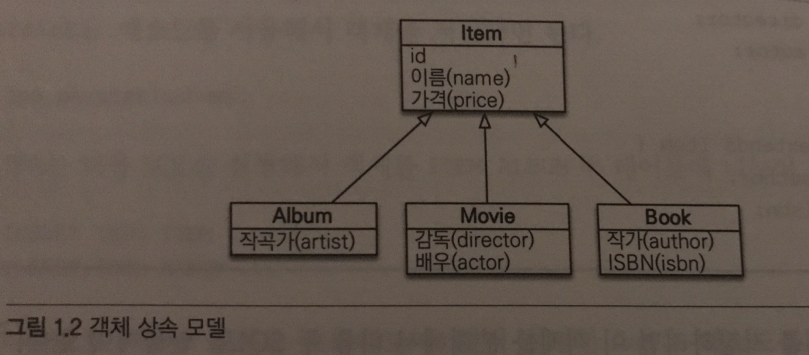

# Overview
비즈니스 요구사항을 정의한 도메인 모델도 객체로 모델링하면 객체지향 언어가 가진 장점들을 활용할 수 있다.
문제는 이렇게 정의한 도메인 모델을 저장할 때 발생한다.

객체는 속성(필드)과 기능(메소드)를 가진다. 객체의 기능을 클래스에 정의되어 있으므로 속성만 저장했다가 필요할 때
불러와서 복구하면 된다. 하지만 부모의 객체를 상속 받았거나, 다른 객체를 참조하는 경우 객체의 상태를 저장하기는 쉽지 않다.

관계형 데이터베이스는 데이터 중심으로 구조회되어 있고, 집합적인 사고를 요구한다. 객체지향의 추상화, 상속, 다향성 같은 개념이 없다.
서로 지향하는 목적이 다르므로 객체와 관계형 데이터베이스의 패러다임 불일치 문제라 한다.

패러다임 불일치의 문제를 개발자가 중간에서 해결해야 하는데 이를 위해 너무 많은 시간과 코드를 소비한다. 패러다임 불일치의 문제점과
JPA를 통한 해결책을 알아본다.

# 상속
객체는 상속이라는 기능을 가지고 있지만, 테이블은 상속이라는 기능이 없다. 그러나 데이터베이스의 모델링에서 슈퍼타입, 서브타입 관계를
사용하면 객체 상속과 가장 유사한 형태로 테이블을 설계할 수 있다.

> 객체 모델 코드
~~~java
abstract class Item {
    Long id;
    String name;
    int price;
}

class Album extends Item {
    String artist;
}

class Movie extends Item {
    String director;
    String actor;
}

class Book extends Item {
    String author;
    String isbn;
}
~~~

Album 객체를 저장하려면 이 객체를 분해해서 다음 두 SQL을 만들어야 한다.
~~~sql
INSERT INTO item ...
INSERT INTO album ...
~~~
Movie 객체도 마찬가지이다.
~~~sql
INSERT INTO item ...
INSERT INTO movie ...
~~~
JDBC API를 이용해서 이 코드를 완성하려면 부모 객체에서 부모 데이터만 꺼내서 item용 INSERT SQL을 작성하, 자식 객체에서 자식 데이터만
꺼내서 album용 INSERT SQL을 작성해야 한다.

album을 조회하는 경우는 item과 album 테이블을 조인해서 조회한 후 그 결과로 album 객체를 생성해야 한다. 이러한 과정이 모두 패러다임의 불일치를
해결하려고 소모하는 비용이다.

해당 객체들을 데이터베이스가 아닌 자바 컬렉션에 보관한다면 부모 자식이나 타입에 대한 고민 없이 해당 컬렉션을 그냥 사용하면 된다.
~~~java
list.add(album);
list.add(movie);

Album album = list.get(id);
~~~

# JPA와 상속
JPA는 상속과 관련된 패러다임 불일치 문제를 개발자 대신 해결해준다. 자바 컬렉션에 저장하듯이 JPA에게 객채를 저장하면 된다.

item을 상속한 album을 JPA로 아래처럼 저장한다면 JPA는 item, album 두 테이블에 INSERT SQL을 작성하여 나누어 저장한다.
~~~java
jpa.persist(album); // 저장
~~~
JPA로 아래처럼 Album 객체를 조회해보자.
~~~java
jpa.find(Album.class, id);
~~~
JPA는 item과 album 두 테이블을 조인해서 데이터를 조회하고 결과를 반환한다.