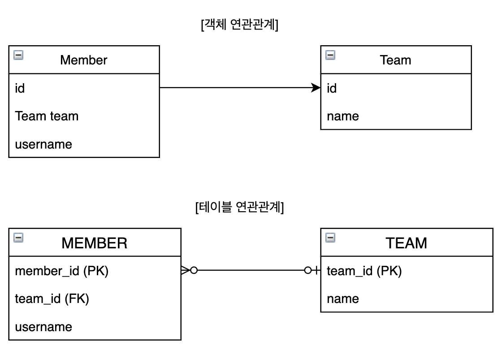

# 연관관계

Member 객체는 Member.team 필드에 Team 객체의 참조를 보관해서 Team 객체와 관계를 맺는다. 
~~~java
class Member {
    Team team;
    ...
    Team getTeam() {
        return team;
    }
}

class Team {
    ...
}

member.getTeam(); // member -> team 접근
~~~
Member 테이블은 MEMBER.team_id 외래 키 컬럼을 사용하여 TEAM 테이블과 관계를 맺고, 조인을 통해 MEMBER 테이블과 함께 연관된
TEAM 테이블을 조회할 수 있다.
~~~sql
SELECT M.*, T.*
FROM MEMBER M
JOIN TEAM T ON M.team_id = T.team_id
~~~
객체는 참조가 있는 한방향으로만 조회할 수 있는 반면에 테이블은 외래키 하나로 MEMBER JOIN TEAM, TEAM JOIN MEMBER도 가능하다.

***객체를 테이블에 맞추어 모델링***

객체와 테이블의 차이를 알기 위해 객체를 단순히 테이블에 맞추어 모델링해보자.
~~~java
class Member {
    String id;
    Long teamId; //team id FK 컬럼 사용
    String username;
}

class Team {
    Long id;    //team id PK 사용
    String name;
}
~~~
이렇게 객체를 테이블에 맞추어 모델링하면 객체를 테이블에 저장하거나 조회할 때는 편리하다. 그러나 team_id 외래키의 값을
그대로 보관하는 teamId 필드에는 문제가 있다.

관계형 데이터베이스는 조인이라는 기능이 있으므로 외래 키의 값을 그대로 보관해도 된다. 하지만 객체는 연관된 객체의 참조를 
보관해야 연관객체를 찾을 수 있다. 소속된 팀을 조회하는 가장 객체지향적인 방법은 이처럼 참조를 사용하는 것이다.

Member.teamId 필드처럼 team_id 외래키까지 관계형 데이터베이스의 방식에 맞추면 Member 객체와 연관된 Team 객체를 참조를
통해 조회할 수 없다.

***객체지향 모델링***

객체는 참조를 통해서 관계를 맺는다. 아래와 같이 참조를 사용하도록 모델링해야 한다.
~~~java
class Member {
    String id;  //member_id 컬럼
    Team team;  //참조로 연관관계를 맺는다.
    String username;    //username 컬럼
    
    Team getTeam() {
        return team;
    }
}

class Team {
    Long id;    //team_id PK 사용
    String name;    // name 컬럼
}
~~~
Member 객체는 team 필드로 연관관계를 맺고 MEMBER 테이블은 team_id 외래 키로 연관관계를 맺는다. 객체 모델은 외래 키가
필요없고, 단지 참조만 있으면 된다. 반면에 테이블은 외래 키만 있으면 된다. 결국, 개발자가 중간에서 변환 역할을 해야 한다.

> 저장
객체를 데이터베이스에 저장하려면 team 필드의 team_id 외래 키 값으로 변환하여 INSERT SQL을 만들어야 한다.
~~~java
member.getId(); // member_id PK에 저장
member.getTeam().getId() // team_id FK에 저장
member.getUsername() // username 컬럼에 저장
~~~

> 조회
조회 시에는 team_id 외래 키 값을 Member 객체의 team 참조로 변환해서 객체에 보관해야 한다. 다음과 같이 member와 team을 조회한다.
~~~sql
SELECT M.*, T.*
FROM MEMBER M
JOIN TEAM T ON M.team_id = T.team_id
~~~

SQL의 결과로 객체를 생성하고 연관관계를 설정해서 반환하면 된다.
~~~java
public Member find(String memberId) {
    //SQL 실행
    ...
    Member member = new Member();
    ...
    //데이터베이스에서 조회한 회원정보를 모두 입력

    Team team = new Team();
    ...
    //데이터베이스에서 조회한 팀 정보를 모두 입력
    
    //회원과 팀 관계 설정
    member.setTeam(team);

    return member;
~~~
이런 과정들은 모두 패러다임 불일치를 해결하려고 소모하는 비용이다. 자바 컬렉션에 회원 객체를 저장한다면 이런 비용은 전혀 들지 않는다.

***JPA와 연관관계***

JPA는 연관관계와 관련된 패러다임 불일치 문제를 해결해준다.
~~~java
member.setTeam(team); //회원과 팀 연관관계 설정
jpa.persist(member); //회원과 연관관계 함께 저장
~~~
개발자는 연관관계를 설정하고, 저장하면 JPA가 객체의 참조를 외래 키로 변환해서 적절한 INSERT SQL을 데이터베이스에 전달한다.
객체를 조회할 때도 외래 키를 참조로 변환하는 일도 JPA가 처리해준다.
~~~java
Member member = jpa.find(Member.class, memberId);
Team team = member.getTeam();
~~~ 