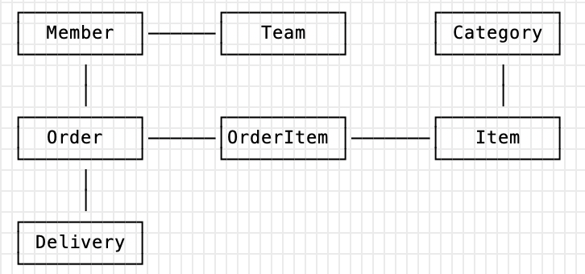

# 객체 그래프 탐색
객체에서 회원이 소속된 팀을 조회할 때는 참조를 사용해서 연관된 팀을 찾으면
되는데, 이 것을 객체 그래프 탐색이라고 한다.
                                                               
  
                                                                                                                                       
***객체 그래프 탐색***
~~~java
member.getOrder().getOrderItem() ... // 자유로운 객체 그래프 탐색
~~~
SQL을 이용하는 경우 마음 것 객체 그래프를 탐색하기 어렵다.
~~~sql
SELECT M.*, T.*
FROM MEMBER M
JOIN TEAM T ON M.team_id = T.team_id
~~~
MemberDAO에서 Member 객체를 조회할 때 이런 SQL을 실행해서 회원을 조회했다면,
member.getTeam()은 성공하지만 다른 객체 그래프틑 데이터가 없으므로 탐색할 수 없다.

***JPA와 객체 그래프 탐색***

JPA는 연관된 객체를 사용하는 시점에 적절한 SELECT SQL을 실행한다. 따라서 JPA를 사용하면
연관된 객체를 신뢰하고 마음껏 조회할 수 있다. 이 기능은 실제 객체를 사용하는 시점까지 데이터베이스 조회를
미룬다고 해서 ***지연 로딩***이라 한다.

Member를 사용할 때마다 Order를 함께 사용한다면, 한 테이블씩 조회하는 것보다는 Member를 조회하는 시점에
SQL 조인을 사용해서 함께 조회하는 것이 효과적이다.

JPA는 연관된 객체를 즉시 함께 조회할지 아니면 실제 사용되는 시점에 지연해서 조회할지를
간단하게 설정으로 정의할 수 있다. 

# 비교
데이터베이스는 기본 키의 값으로 각 row를 구분한다. 반면에 객체는 동일성(identity) 비교와
동등성(equality) 비교라는 두 가지 비교 방법이 있다.
* 동일성 비교는 == 비교다. 객체 인스턴스의 주소 값을 비교한다.
* 동등성 비교는 equals() 메소드를 사용해서 객체 내부의 값을 비교한다.
~~~java
class MemberDAO {
    public Member getMember(String memberId) {
        String sql = SELECT * FROM MEMBER WHERE member_id = ?;
        ...
        //JDBC API, SQL 실행
        return new Member(...);
    }
}

String memberId = "100";
Member member1 = memberDAO.getMember(memberId);
Member member2 = memberDAO.getMember(memberId);

member1 == member2; //다르다.
~~~
기본 키가 같은 Member를 두번 조회했다. 그런데 둘을 동일성 비교하면 false가 반환된다.
member1과 member2는 같은 로우를 조회했지만, 객체 측면에서 둘을 다른 인스턴스이기 때문이다.
만약 객체를 컬렉션에 보관했다면 동일성 비교에 성공했을 것이다.
~~~java
Member member1 = list.get(0);
Member member2 = list.get(0);

member1 == member2; //같다.
~~~
이런 패러다임 불일치 문제를 해결하기 위해 JPA는 같은 트랜잭션일 때 같은 객체가 조회되는 것을 보장한다.

***JPA와 비교***
~~~java
String memberId = "100";
Member member1 = jpa.find(Member.class, memberId);
Member member2 = jpa.find(Member.class, memberId);

member1 == member2; //같다.
~~~