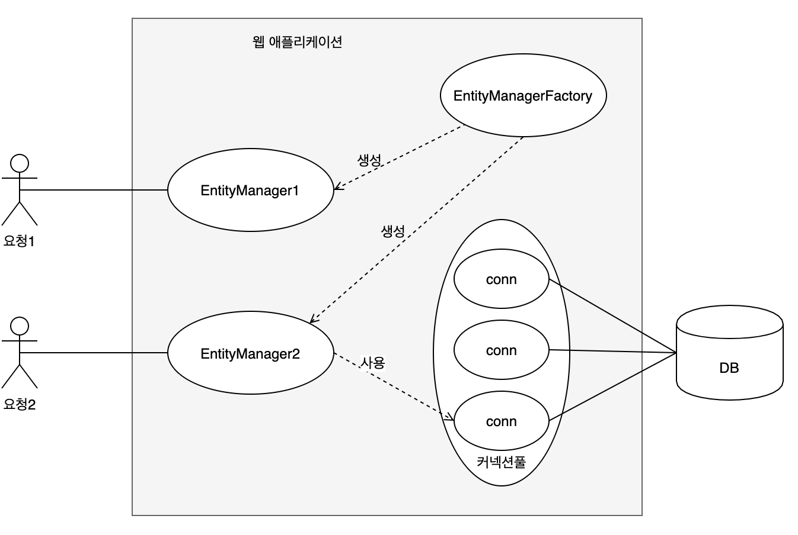

# 엔티티 매니저 팩토리와 엔티티 매니저
데이터베이스를 하나만 사용하는 애플리케이션은 일반적으로 ***EntityManaterFactory***를 하나만 
생성한다. 아래는 EntityManagerFactor를 생성하는 코드이다.
~~~java
EntityManagerFactory emf = 
    Persistence.createEntityManagerFactory("jpabook");
~~~
Persistence.createEntityManagerFactory("jpabook")를 호출하면 ***META_INF/persistence.xml***에 있는 정보를 바탕으로
***EntityManagerFactory***를 생성한다.

엔티티 매니저 팩토리를 생성하는 비용은 상당이 크므로 한개만 만들어서 애플리케이션 전체에서 공유하여 사용하도록 설계되어 있다.

> persistence.xml
~~~xml
<persistence-unit name="jpabook">
    <properties>
        <property name="javax.persistence.jdbc.driver" value="org.h2.Driver" />
        <property name="javax.persistence.jdbc.user" value="sa" />
        <property name="javax.persistence.jdbc.password" value="" />
        <property name="javax.persistence.jdbc.url" value="jdbc:h2:tcp://localhost/~/test" />
    </properties>
</persistence-unit>
~~~
이제부터 필요할 때마다 EntityManager를 생성할 수 있다.
~~~java
// 엔티티 매니저 팩토리에서 엔티티 매니저를 생성. 비용이 거의 안 든다.
EntityManager em = emf.createEntityManager();
~~~
***EntityManager***는 엔티티 매니저 팩토리에서 생성 시 비용이 거의 들지 않는다. 그리고 엔티티 매니저 팩토리는 여러 쓰레드에서
동시 접근해도 안전하지만, ***EntityManager***는 여러 쓰레드가 동시 접근하면 동시성 문제가 발생하므로 스레드 간에 절대 공유하면
안된다.

위 그림을 보면 하나의 ***EntityManagerFactory***에서 다수의 ***EntityManager***를 생성했다.
***EntityManager1***은 아직 데이터베이스 커넥션을 사용하지 않는다. 

***EntityManager***는 데이터베이스 연결이 꼭 필요한 시점까지 커네션을 얻지 않는다. 보통 트랜잭션을 시작할 때 커넥션을 획득한다.