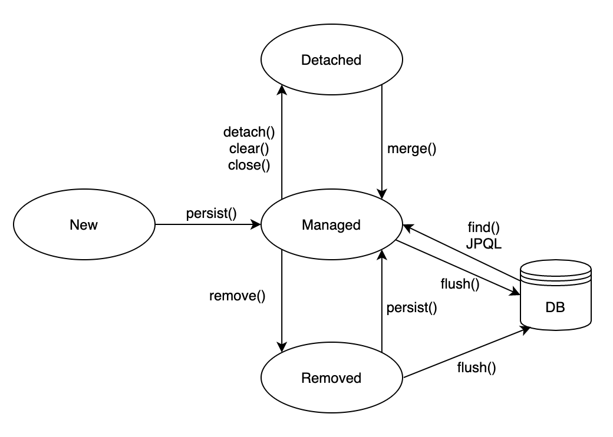

# 영속성 컨텍스트란 (Persistence Context)?
***"엔티티를 영구 저장하는 환경"*** 이라고 해석할 수 있다. 엔티티 매니저로 엔티티를 저장하거나 조회하면 엔티티 매니저는 영속성
컨텍스트에 엔티티를 보관하고 관리한다.
~~~java
e.persist(member); // 영속성 컨텍스트에 저장
~~~
persist() 메소드는 ***엔티티 매니저를 사용해서 회원 엔티티를 영속성 컨텍스트에 저장***한다.

# 엔티티의 생명주기
* 비영속(new/transient): 영속성 컨텍스트와 전혀 관계가 없는 상태
* 영속(managed): 영속성 컨텍스트에 저장된 상태
* 준영속(detached): 영속성 컨텍스트에 저장되었다가 분리된 상태
* 삭제(removed): 삭제된 상태

***비영속***

엔티티 객체를 생성하였고, 아직은 순수한 객체 상태이며 아직 저장하지 않음. 따라서 영속성 컨텍스트나
데이터베이스와는 전혀 관련이 없는 상태 (em.persist() 호출 전)

***영속***

엔티티 매니저를 통해서 엔티티를 영속성 컨텍스트에 저장. 이렇게 ***영속성 컨텍스트가 관리하는 엔티티를
영속 상태***라 한다.

***준영속***

영속성 컨텍스트가 관리하던 영속 상태의 엔티티를 영속성 컨텍스트가 관리하지 않으면 준영속 상태가 된다.
em.detach() 메소드를 호출하거나 em.close() 메소드를 호출해서 영속성 컨텍스트를 닫거나 em.clear() 메소드를 호출해서
영속성 컨텍스트를 초기화해도 영속 상태의 엔티티는 준영속 상태가 된다.

***삭제***

엔티티를 영속성 컨텍스트와 데이터베이스에서 삭제.
~~~java
// 객체를 삭제한 상태 (삭제)
em.remove(member);
~~~