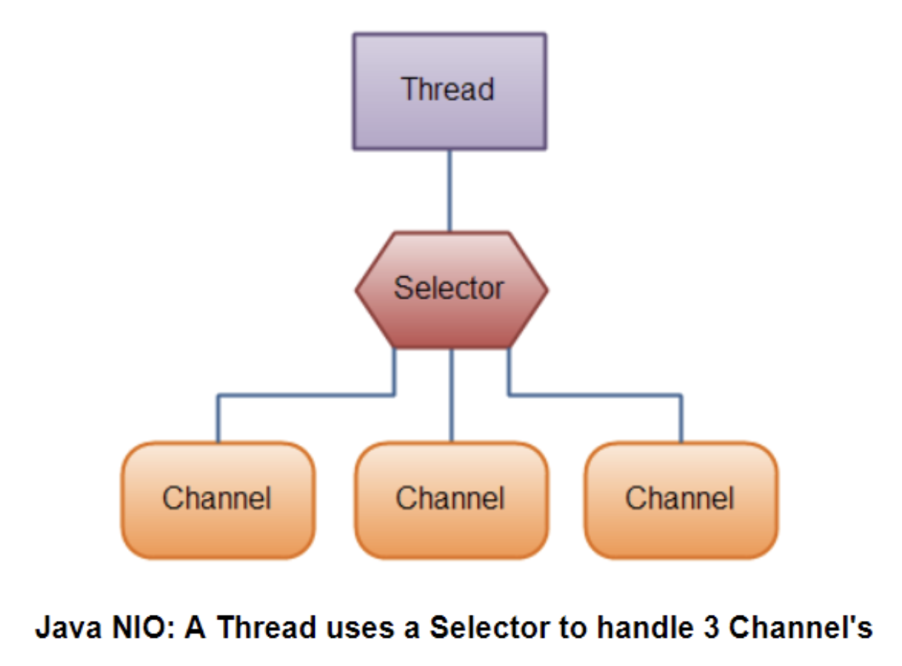

# Overview
Netty의 개념과 아키텍처에 대해 알아보자.

# Java의 네트워킹
순수 자바로 네트워킹 통신을 위해 생긴 최초의 라이브러리를 java.net 패키지이다. 해당 소켓 라이브러리는 
아래 코드처럼 블록킹 방식만 지원했다.
~~~java
public void blockCall() throws IOException {
    ServerSocket serverSocket = new ServerSocket(8080);
    Socket clientSocket = serverSocket.accept();
    BufferedReader in = new BufferedReader(
        new InputStreamReader(clientSocket.getInputStream()));
    
    PrintWriter out = new PrintWriter(clientSocket.getOutputStream(), true);
    
    String request, response;
    while((request = in.readLine) != null) {
        if ("OK".equals(request)) {
            break;
        }
        response = processRequest(request);
        System.out.println(response);
    }
}

public String processRequest(String request) {
    return request + "Done";
}
~~~
해당 코드는 한 번에 한 연결만 처리한다. 다수의 동시 클라이언트를 관리하려면 새로운 클라이언트 소켓마다 새로운
Thread를 할당해야 한다. 이런식의 블로킹 처리는 여러 스레드가 입력이나 출력 데이터가 들어오기를 기다리며,
무한정 대기 상태로 유지될 수 있고, 리소스 낭비로 이어진다. 그리고 하나의 연결 당 하나의 스레드가 생성되므로
많은 수의 클라이언트를 관리하기 위해서는 많은 수의 스레드를 생성해야 하고, 잦은 컨텍스트 스위칭에 의한 오버헤드가
밸생한다.

# Java NIO
네트워크 리소스를 세부적으로 제어할 수 있는 논블로킹 호출이 포함되어 있다. 논블로킹은 내부적으로 시스템의 이벤트 통지 API
를 이용해 논블로킹 소켓의 집합을 등록하면 읽거나 기록할 데이터가 준비됐는지 알 수 있다. 즉, 계속해서 기다릴 필요가
없어지는 것이다.

NIO는 채널과 소켓이 1:1 매칭되지 않는다. java.nio.channels.Selector가 논블로킹 Socket의 집합에서 입출력이 가능한 항목을 지정하기 위해 
이벤트 통지 API를 이용하기 때문에, 언제든지 읽기나 쓰기 작업의 완료상태를 확인가능하다. 그렇기 때문에 필요할때마다 쓰레드에게 통지를 
하므로써 필요할때만 일을 할 수 있고, 필요하지 않을때는 다른 일을 할 수 있게 한다.
* 적은 수의 스레드로 더 많은 연결을 처리할 수 있어 메모리 관리와 컨텍스트 스위치에 대한 오버헤드가 준다.
* 입출력을 처리하지 않을 때는 스레드를 다른 작업에 활용할 수 있다.

# Netty
NIO 같이 어려운 자바의 고급 API를 내부에 숨겨놓고, 사용자에게 비즈니스 로직에만 집중할 수 있도록 추상화한 API를 제공한다. 또한,
적은 양의 리소스를 사용하면서 더 많은 요청을 처리할 수 있게 설계되었다.

***Netty의 특징***

|Category   |feature|
|-----------|-------|
|설계       |단일 API로 블로킹과 논블로킹 방식의 여러 전송 유형을 지원하며, 단순하지만 강력한 스레딩 모델을 제공
|이용 편의성|JDK 1/6+을 제외한 추가 의존성이 필요 없음
|성능       |코어 자바 API 보다 높은 처리량과 짧은 지연시간을 갖음. 풀링과 재사용을 통한 리소스 소비를 감소시켰고, 메모리 복사를 최소화함
|견고성     |OOM이 잘 발생하지 않는다.(요청을 처리하는 스레드 수가 굉장히 적기 때문) 고속 네트워크 상의 NIO 애플리케이션에서 일반적인 읽기/쓰기 비율 불균형이 발생하지 않음
|보안       |완벽한 SSL/TLS 및 StarTLS 지원. 애플릿이나 OSGi 같은 제한된 환경에서도 이용 가능

***비동기식 이벤트 기반 네트워킹***
* Netty의 논블로킹 네트워크 연결은 작업 완료를 기다릴 필요없이 즉시 반환하며 작업이 완료되면 직접 또는 나중에 이를 통지한다.
* 셀렉터는 적은 수의 스레드로 여러 연결에서 이벤트를 모니터링 할 수 있게 해준다.
> 위의 특징들을 종합해보면 블로킹 입출력 방식을 이용할 때보다 더 많은 이벤트를 훨씬 빠르고 경제적으로 처리할 수 있다.

***Netty의 핵심 컴포넌트***
* Channel
* Callback
* Future
* 이벤트와 핸들러

***Channel***은 하나 이상의 입출력 작업을 수행할 수 있는 하드웨어 장치, 파일, 네트워크 소켓, 프로그램 컴포넌트와 같은 엔티티에 대한 열린 연결을 뜻한다.

***Callback***은 간단히 말해 다른 메서드로 자신에 대한 참조를 제공할 수 있는 메서드다. 관심 대상에게 작업 완료를 알리는 가장 일반적인 방법 중 하나이다. 
네티는 이러한 콜백을 내부적으로 이벤트 처리에 사용한다.

***Future***는 작업이 완료되면 애플리케이션에게 알리는 한 방법이다. 즉, 작업이 완료되는 미래의 어떤 시점에 그 결과에 접근할 수 있게 해준다. 
하지만 자바의 Future는 결과를 얻기 위해서는 반드시 블로킹해야만 한다. 그래서 네티는 비동기 작업이 실행됐을 때 이용할 수 있는 
자체 구현 ***ChannelFuture***를 제공한다.

# References
* https://coding-start.tistory.com/category/Web/Netty