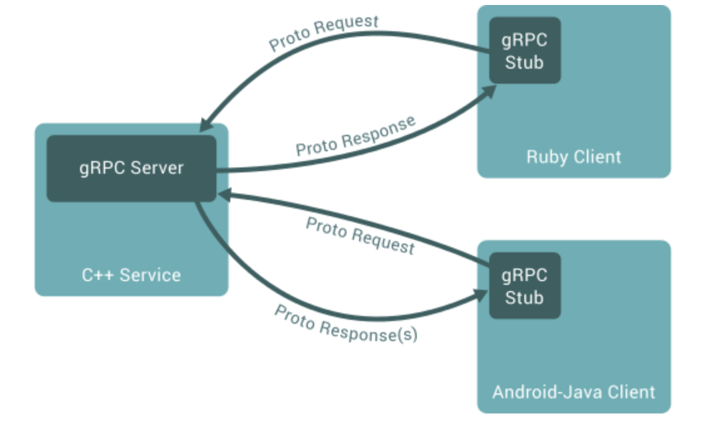
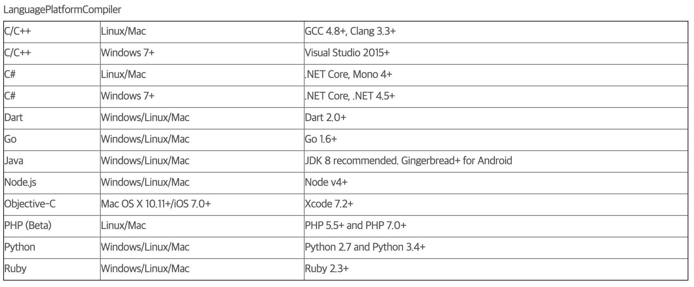
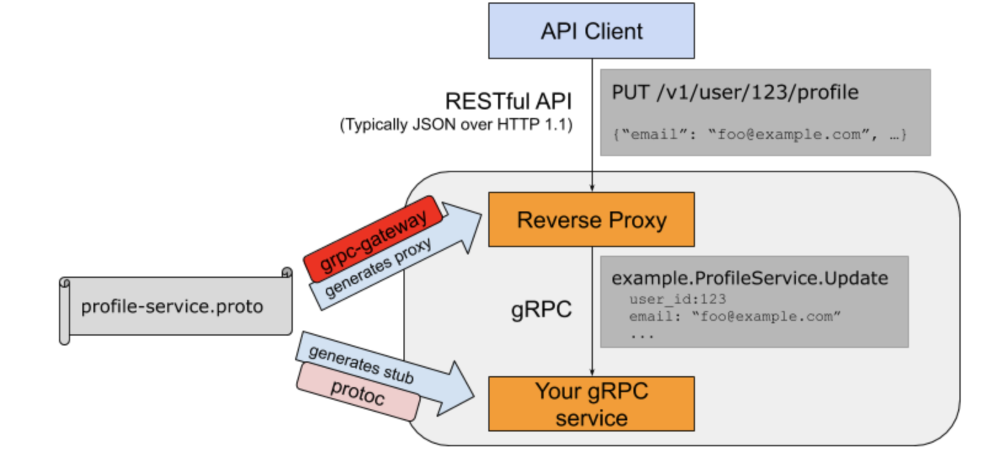

# Overview
* Protocol Buffer를 IDL(Interface Definition Language)로 사용하는 RPC 프레임워크
* 구글에서 10년 이상동안 MSA 아키텍처 이하 수많은 시스템들, 데이터 센터 간 통신을 위해 사용하던 범용 RPC 프레임워크 인 Stubby를 오픈소스로 공개한 것

## RPC란?

* RPC(Remote Procedure Call)은 별도의 원격제어 없이 프로세스 간 함수나 프로시저를 호출할 수 있도록 하는 통신 기술
* 서로 통신하는 양 측의 Request, Response에 대한 인터페이스를 정의 후 양 측에 맞는 프로그램 코드로 변환해야 함
* 인터페이스를 정의하는 용어를 IDL(Interface Definition Language)라 함
* IDL이 특정 언어의 코드로 변환된 결과를 Skeleton(서버 측), Stub(클라이언트 측)이라 함

## Protocol Buffer (ProtoBuf)
* 구글에서 개발한 데이터 직렬화 오픈소스로 gRPC의 IDL로 사용
* 직렬화하려는 데이터의 구조를 프로토 파일에 작성 (.proto)
* ProtoBuf의 데이터는 message들로 구성되고, 각 message는 field(name, value fair)로 구성
~~~
message Person {
    String name = 1;
    int32 id = 2;
    bool has_ponycopter = 3;
}
~~~
프로토 파일을 protoc(프로토콜 버퍼 컴파일러)로 원하는 언어로 컴파일(변환)하여 사용

# gRPC의 특징
* 높은 생산성과 효율적인 유지보수
    * 서비스와 메세지를 정의하기 위해 오직 ProtoBuf만 사용
* 다양한 언어와 플랫폼 지원

* HTTP/2 기반 통신
    * 기존 HTTP와는 다르게 서버와 클라이언가 서로 데이터를 스트리밍으로 주고 받을 수 있음
        * simple RPC : 클라이언트 요청에 서버가 응답하고 종료
        * server-side streaming RPC : 클라이언트 요청에 응답을 여러번 보냄
        * client-side streaming RPC : 클라이언트가 요청을 여러번 보내고, 요청이 끝나면 응답을 보냄
        * bidirectional streaming RPC : 양방향 독립적으로 요청/응답을 보냄
    * 기존 HTTP 보다 높은 헤더 압축율이 보장되고, ProtoBuf의 직렬화에 의해 전송되는 메시지가 획기적으로 줄어듬

# gRPC vs REST
* Payload의 차이
    * gRPC는 ProtoBuf 형식에 대한 직렬화된 데이터
    * REST는 JSON 데이터를 주고 받음
* HTTP 버전 차이
    * gRPC는 HTTP/2 기반 통신
    * REST는 일반적으로 HTTP/1.1 통신
    * gRPC는 스트리밍, 헤더 압축 등 HTTP/2의 여러 장점을 확보
* 호출 방식의 차이
    * gRPC는 proto 파일에 정의한 message, service 를 각 언어에 맞는 형태로 generate 됨. 클라이언트에서 service 메소드를 호출하면
    그에 해당하는 서버의 service가 실행되고, 요청/응답 Payload는 언어에 맞는 generate 결과를 사용
    * REST는 엔드포인트를 HTTP Method + URI로 표현하고, 페이로드 처리는 각 서버/클라이언트 측에서 각각 부담

# gRPC의 활용
* gRPC는 단일 인스턴스 부터 수십 수백개의 인스턴스가 상호작용하는 MSA까지 모든 구조에서 사용 가능
* 클라이언트 측에 gRPC Stub 라이브러리를 제공해줘야 하는 점 등 제약이 존재
* gRPC Gateway 플러그인을 사용하면 gRPC 서비스에 REST API 인터페이스를 제공할 수 있게 go 런타임에서 작동하는 프록시 서버와 
Swagger 문서를 generate 해줌
    * [Spring Boot gRPC + grpc-gateway 예시](https://github.com/wejrowski/grpc-gateway-java-gradle) 
    * [grpc-gateway 공식 문서](https://grpc-ecosystem.github.io/grpc-gateway/)
    

# References
* https://do-study.tistory.com/94