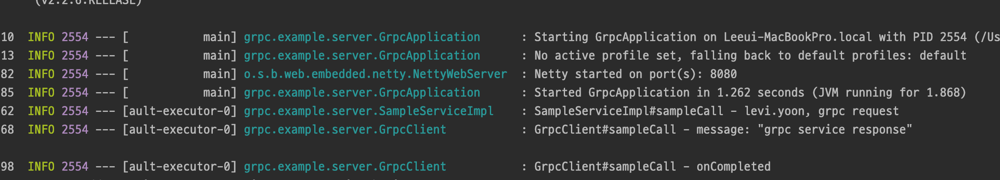

# Overview
gRPC Java를 이용해서 간단하게 예제 코드를 작성해본다.

# Gradle
~~~groovy
buildscript {
    repositories {
        mavenCentral()
    }
    dependencies {
        classpath 'com.google.protobuf:protobuf-gradle-plugin:0.8.8'
    }
}

plugins {
    id 'org.springframework.boot' version '2.2.6.RELEASE'
    id 'io.spring.dependency-management' version '1.0.9.RELEASE'
    id 'java'
}

apply plugin: 'com.google.protobuf'

group 'org.example'
version '1.0-SNAPSHOT'

configurations {
    compileOnly {
        extendsFrom annotationProcessor
    }
}

repositories {
    mavenCentral()
}

dependencies {
    /**
     * gRPC
     */
    compile group: 'io.grpc', name: 'grpc-netty-shaded', version: '1.21.0'
    compile group: 'io.grpc', name: 'grpc-protobuf', version: '1.21.0'
    compile group: 'io.grpc', name: 'grpc-stub', version: '1.21.0'

    implementation "com.google.protobuf:protobuf-java-util:3.8.0"
    compile group: 'com.google.protobuf', name: 'protobuf-java', version: '3.8.0'
    implementation 'org.springframework.boot:spring-boot-starter-webflux'

    compileOnly 'org.projectlombok:lombok'
    annotationProcessor 'org.projectlombok:lombok'
    testImplementation('org.springframework.boot:spring-boot-starter-test') {
        exclude group: 'org.junit.vintage', module: 'junit-vintage-engine'
    }
    testImplementation 'io.projectreactor:reactor-test'
}

test {
    useJUnitPlatform()
}

sourceSets {
    main {
        java {
            srcDirs += [
                    'build/generated/source/proto/main/grpc',
                    'build/generated/source/proto/main/java' ]
        }
    }
}

protobuf {
    protoc {
        artifact = "com.google.protobuf:protoc:3.7.1"
    }
    plugins {
        grpc {
            artifact = 'io.grpc:protoc-gen-grpc-java:1.21.0'
        }
    }
    generateProtoTasks {
        all()*.plugins {
            grpc {}
        }
    }
}
~~~

# Proto
src/main/proto 디렉토리에 SampleService.proto 파일을 작성한다.
Gradle의 generateProto task를 실행하여 Java 소스로 생성한다.
~~~proto
syntax = "proto3";

option java_multiple_files = true;
option java_outer_classname = "SampleProto";
option java_package = "grpc.example";

package grpc.sample;

message SampleRequest {
    string userId = 1;
    string message = 2;
}

message SampleResponse {
    string message = 1;
}

service SampleService {
    rpc SampleCall (SampleRequest) returns (SampleResponse) {}
}
~~~

# Server 구현
## Service 구현
~~~java
@Slf4j
@Service
public class SampleServiceImpl extends SampleServiceGrpc.SampleServiceImplBase {
 
    @Override
    public void sampleCall(SampleRequest request, StreamObserver<SampleResponse> responseObserver) {
        log.info("SampleServiceImpl#sampleCall - {}, {}", request.getUserId(), request.getMessage());
        SampleResponse sampleResponse = SampleResponse.newBuilder()
                .setMessage("grpc service response")
                .build();
 
        responseObserver.onNext(sampleResponse);
        responseObserver.onCompleted();
    }
}
~~~

## gRPC 서버 구동
~~~java
@Component
public class GrpcRunner implements ApplicationRunner {
   private static final int PORT = 3030;
   private static final Server SERVER = ServerBuilder.forPort(PORT)
           .addService(new SampleServiceImpl())
           .build();

   @Override
   public void run(ApplicationArguments args) throws Exception {
       SERVER.start();
   }
}
~~~

# Client 구현
stub 객체를 이용하여 gRPC 원격 메소드 호출하는 클라이언트 코드를 만든다.
~~~java
@Slf4j
@Service
public class GrpcClient {
    private static final int PORT = 3030;
    public static final String HOST = "localhost";
    private final SampleServiceGrpc.SampleServiceStub asyncStub = SampleServiceGrpc.newStub(
            ManagedChannelBuilder.forAddress(HOST, PORT)
                    .usePlaintext()
                    .build()
    );

    public String sampleCall() {
        final SampleRequest sampleRequest = SampleRequest.newBuilder()
                .setUserId("levi.yoon")
                .setMessage("grpc request")
                .build();

        asyncStub.sampleCall(sampleRequest, new StreamObserver<SampleResponse>() {
            @Override
            public void onNext(SampleResponse value) {
                log.info("GrpcClient#sampleCall - {}", value);
            }

            @Override
            public void onError(Throwable t) {
                log.error("GrpcClient#sampleCall - onError");
            }

            @Override
            public void onCompleted() {
                log.info("GrpcClient#sampleCall - onCompleted");
            }
        });
        return "string";
    }
}
~~~

# 실행 및 테스트를 위한 Controller 구현
~~~java
@RestController
@SpringBootApplication
@RequiredArgsConstructor
public class GrpcApplication {
    private final GrpcClient grpcClient;

    public static void main(String[] args) {
        SpringApplication.run(GrpcApplication.class, args);
    }

    @GetMapping("/")
    public Mono<String> test() {
        return Mono.just(grpcClient.sampleCall());
    }
}
~~~

