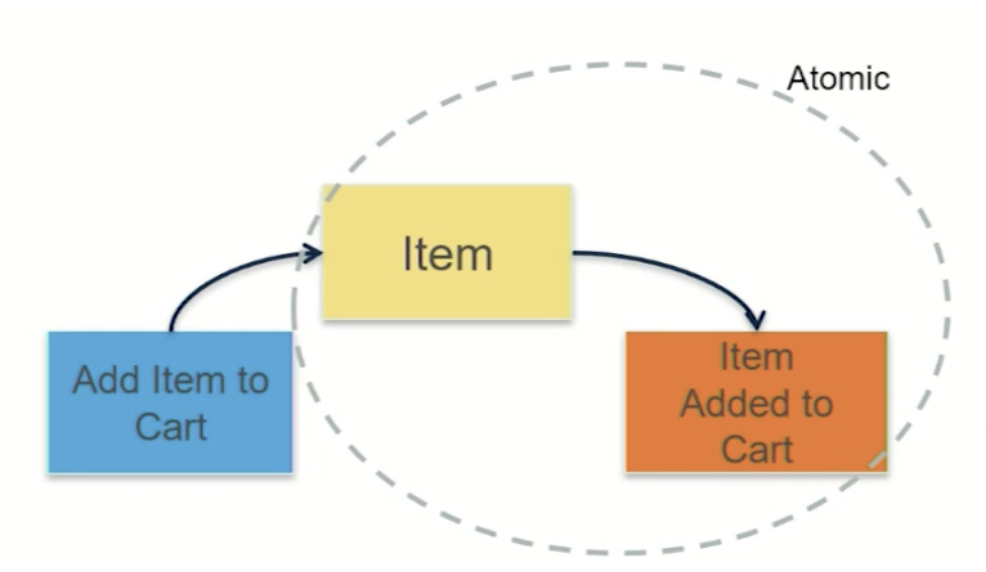

# Overview 
도메인 주도 개발(***Domain Driven Design***)은 실제 비즈니스 모델을 개발 아키텍처에 투영시키는 개발방법론이다.
도메인 전문가들은 IT용어를 잘 모르고, 개발자들은 도메인 전문가들의 용어를 잘 이해하지 못한다. 이런 이유에서 상당한 이슈가
발생하게 되고 개발 Release가 늦어지게 된다. 이를 해결하기 위한 방안으로 ***도메인 주도 설계***라는 방식이 등장하였다.

***도메인 주도 개발***을 위한 ***Event Storming***에 대해 알아본다.

# 도메인이란 무엇인가? 그리고 핵심은?
도메인 이라는 의미는 개발자에게 애플리케이션 내의 로직들이 관여하는 정보와 활동의 영역 정도로 이해할 수 있다. 도메인 주도 설계의
핵심 원칙은 ***"핵심 도메인과 그 기능에 집중하라"***, ***"도메인의 모델의 정교하게 구축하라"***, ***"애플리케이션 모델을 발전시키고 
새롭게 생기는 도메인 관련 이슈를 해결하기 위해 도메인 전문가과 끊임없이 협력하라"*** 이다.

# Event Storming(이벤트 스토밍)
도메인 전문가과 개발자가 같이 참여하여 어떻게 전략적으로 설계를 효율적으로 할 것인가에 대한 방법이다. 이벤트 스토밍은 서비스에 필요한
모든 사람들이 모여서 진행을 한다. 시간이 지남에 따라 발생하는 ***이벤트들을 과거형으로 나열***하고, ***개발요소가 아닌 이벤트와 
비즈니스 프로세스에 집중***한다.

## Domain Events (주황색)

비즈니스 프로세스에서 유발되는 이벤트. ***과거형 동사***로 작성하며, 시간 흐름의 순서대로 왼쪽에서 오른쪽으로 진행하듯 붙임

## Command (파란색)

애그리게잇에 속한 뷰를 통해 엑터가 어떤 커맨드를 실행하고, 그 결과로 도메인 이벤트가 유발된다. ***도메인 이벤트 좌측***에 붙인다. 

## Aggregate (노란색)

커맨드가 실행되고, 이벤트가 벌어지는 것을 무엇이라고 칭할 수 있는지를 표현(도메인 객체들을 하나로 묶은 군집. 
이때, 군집에 속한 객체들을 관리하는 루트 엔티티가 존재) ***커맨드, 도메인 이벤트를 포함토록 상단에 붙임***

## Actor (작은 노란색)

뷰를 통해 들어와 커맨드를 유발할 수 있는 사용자(역할). ***커맨드 옆에 작게 엑터를 붙임***

## View (초록색)

사용자가 시스템과 상호작용 할 수 있는 ***화면***으로 세세하기 보다는 컨셉 정도를 이해하기 위한 보조수단으로 ***커맨드 좌측에 붙임***

## Business Process (보라색)

비즈니스 규칙에 따른 복잡한 절차. 최소 하나 이상의 도메인 이벤트를 유발. 
***독립적으로 존재하며 도메인 이벤트와 동일한 방법으로 좌측에서 우측으로 전개해나감***

## External System (핫핑크)

서드 파티 서비스와 같이 외부에서 제공해주는 것.(가령, PG사 연동) ***비즈니스 프로세스와 마찬가지로 좌측에서 우측으로 전개***

## Issue (빨간색)

모호한 것들. 의사결정이 필요한 것들. 무엇이든 애매한 것들은 즉시 이것으로 표시해 붙임

## Domain Event, Command, Aggregate 상관관계
사용자가 "어떤 아이템을 장바구니에 넣어라." 라는 명령(Command)을 내린다. 실제로는 ***Item***이라는 애그리게잇에 영향을 줘서
"Item이 장바구니에 들어가게 됨"이라는 ***Event***가 발생한다. 

***애그리게잇과 이벤트는 Atomic한 특징을 가진다. 애그리게잇에 상태변화가 생기면 이벤트에도 상태변화가 생긴다.***

# References
* https://syundev.tistory.com/125
* https://helloworld.kurly.com/blog/event-storming/